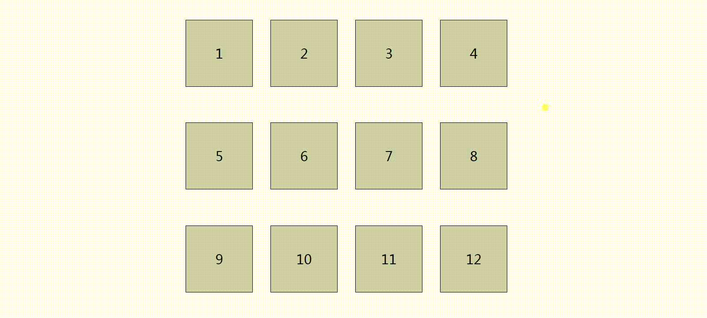

# DragSort in PC
基于react 的拖拽并自动排序   
------------------------------------------------------------------------------------------------------
使用方法
------------------------------------------------------------------------------------------------------
```jsx
    <DragSort   
        clickElement = {(element) => {
            console.log("点中的元素是：",element);
        }}
        dragElement = {(element) => {
            console.log("拖拽的持续过程ing，被拖拽元素是：",element);
        }}
        dragOver = {(element) => {
            console.log("拖拽结束（松开鼠标的时候）",element);
        }}

        moveStop = {() => {
            console.log("每一个元素运动停止了以后（只要是点一下就会有 moveStop）");
        } }

        time="1000"//运动时间 默认500ms
        type="ease-out"//运动类型 ease-out减速 默认  ease-in加速 linear匀速 
        className="dragSort"            
    >
        <div>拖动的元素1</div>
        <div>拖动的元素2</div>
        <div>拖动的元素3</div>
        <div>拖动的元素4</div>
        <div>拖动的元素5</div>
        <div>拖动的元素6</div>
        <div>拖动的元素7</div>
        <div>拖动的元素8</div>
        <div>拖动的元素9</div>      
    </DragSort>
```
## API
---------------------------------------------------------------------------------------------------------

| 属性          | 说明                                                      | 默认值|   类型   |
| ------------- |:--------------------------------------------------------:|:-----:|:-------:|
| clickElement  | 点中的元素                                                 |      |function |
| dragElement   | 拖拽的持续过程                                             |       |function |
| dragOver      | 拖拽结束（松开鼠标的时候）                                  |       |function |
| moveStop      | 每一个元素运动停止了以后（只要是点一下就会有 moveStop）       |       |function |
| time          | 运动时间                                                   | 500ms | string  |
| type          | 运动类型 ease-out减速 默认  ease-in加速 linear匀速          |ease-out|  string |

## 预览 ##

* 概览

<p align="center">
    
</p>